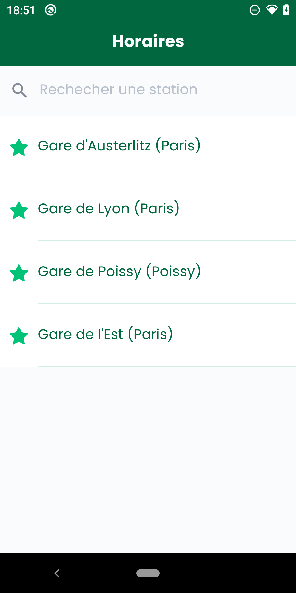
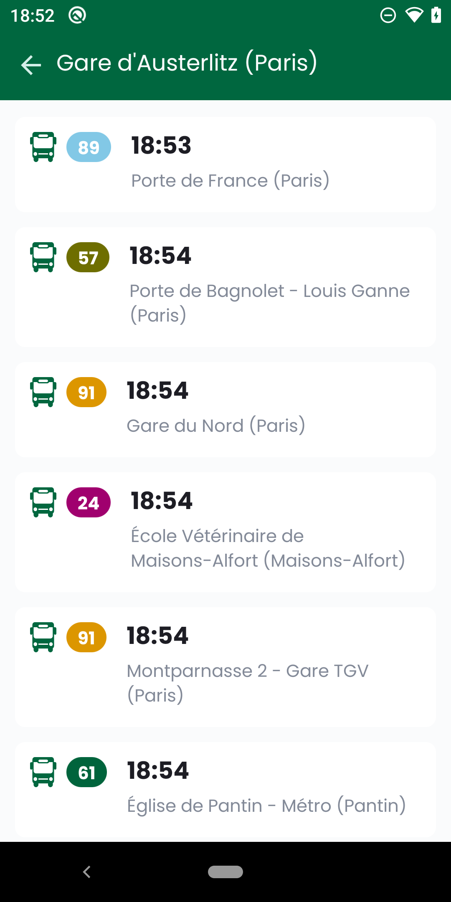

# Test Rogervoice

I chose a simple application without modules for the test but this is what I would do for a real application 🙂

I also chose not to implement pagination management for the test, but feel free to tell me if you want 🙂

For the test, I just added some unit tests on ViewModels but on a real project I would add other unit tests as well as Espresso tests.